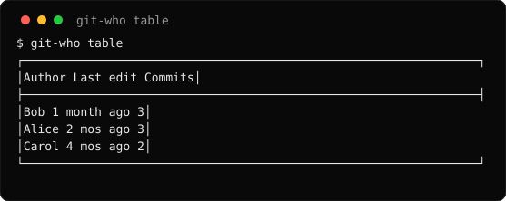
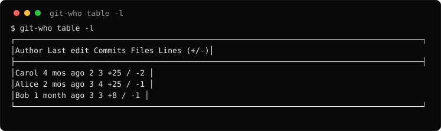
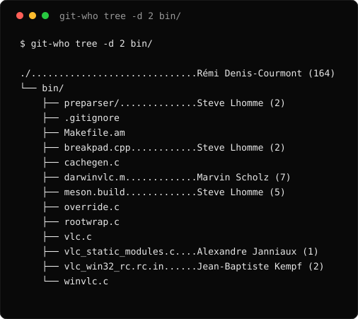
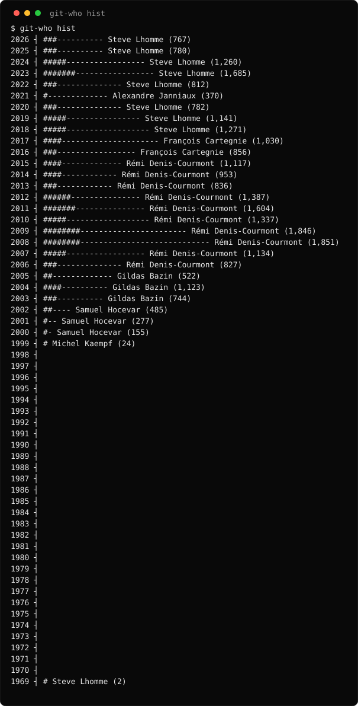
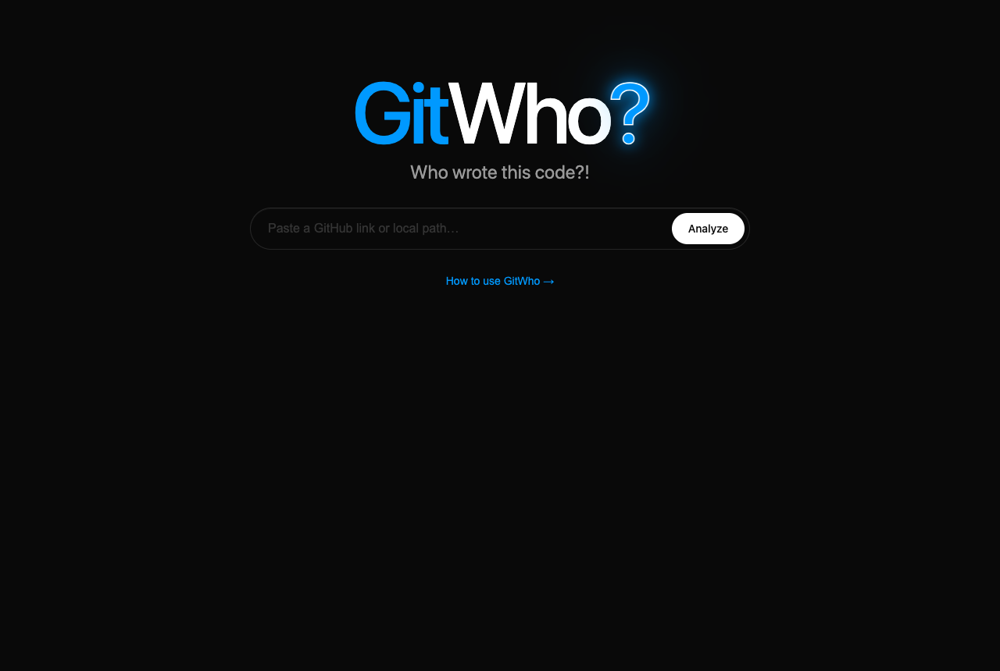
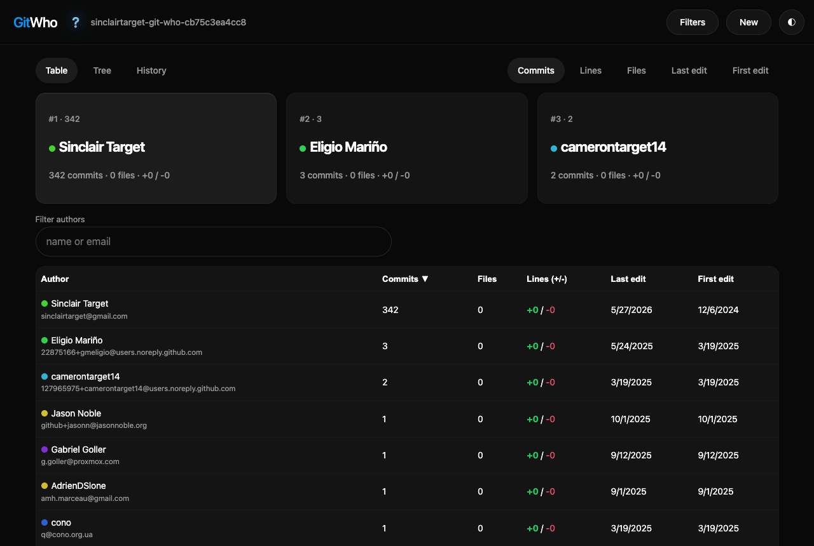
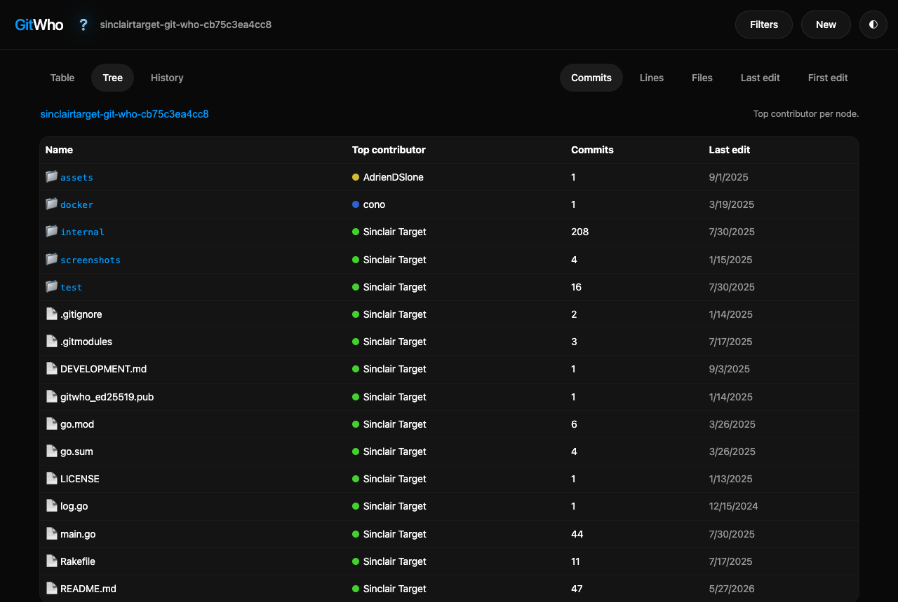
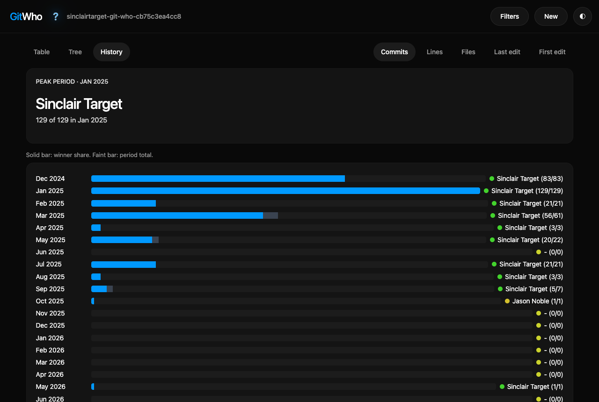

# GitWho

> **Who wrote this code?!** `git blame` for file trees.

`git blame` covers a line. GitWho covers a component: every directory,
subsystem, and era of a repo, ranked by author. Dependency-free Go CLI plus
a local web UI.

## Features

- **Table**: rank authors by commits, lines, files, first/last edit.
- **Tree**: file browser showing the top contributor per node.
- **History**: timeline of the winning author per period.
- **Web UI**: local repo path or GitHub link, with sorting, filtering, dark mode.
- **JSON**: every view outputs machine-readable JSON (`--json`).
- **Filters**: revision range, path, author, date.
- **Streaming**: history parses as it arrives. Flat memory on large repos.

## Quickstart

Requires Go:

```bash
go install github.com/GrrrGe/git-who@latest
```

From source (Go only, zero dependencies):

```bash
git clone https://github.com/GrrrGe/git-who.git
cd git-who
make install
```

### Put it on PATH

Both methods place the binary where Go keeps executables (`go env GOPATH`/bin,
usually `~/go/bin`). If your shell cannot find `git-who`, add that directory
to PATH once (in `~/.zshrc` or `~/.bashrc`):

```bash
export PATH="$PATH:$(go env GOPATH)/bin"
```

Verify from any repo:

```bash
git-who --version
```

The binary is named `git-who`, so plain `git who` works too once it is on
PATH.

Web UI:

```bash
git-who serve --repo /path/to/your/repo
```

Without `--repo`, the landing page accepts a GitHub link
(`owner/repo` or full URL, cloned to cache on demand) or a local path.
The glowing **?** opens the built-in guide.

CLI:

```bash
cd /path/to/your/repo
git-who                 # top authors by commits
git-who -l              # rank by lines added + removed
git-who tree internal/  # top contributor per directory under internal/
git-who hist            # timeline of top authors
```

## Screenshots

Real output. `screenshots/gen.go` rebuilds these from a demo repo.

Rank authors. `-l` adds files and lines:





Top contributor per node (`-d` limits depth, `-a` annotates every file):



Timeline (`-l` ranks periods by lines):



## Web UI screenshots

Same repo in the browser (`web/shot.mjs` captures these):









## Web UI

`git-who serve` flags: `--port`, `--repo`. The UI is a single-page app
embedded in the binary.

- **Landing**: search box. GitHub link or local path, then Analyze.
- **Table**: sortable, filterable ledger. Commits, files, lines (+/-),
  first/last edit.
- **Tree**: browser with breadcrumbs. Top contributor and metric per row.
- **History**: bar chart per period. Winner and period totals.
- **Filters button**: revision, path, author include/exclude, calendar date
  range, email, merges, hidden files. Badge shows active count.
- **Guide (?)**: use cases plus CLI reference, inside the app.

### HTTP API

All endpoints take `repo` (local path or GitHub link) and return JSON:

| Endpoint      | Result                                             |
| ------------- | -------------------------------------------------- |
| `/api/table`  | Ranked authors with commits/files/lines/edit times |
| `/api/tree`   | Nested file tree with top contributor per node     |
| `/api/hist`   | Per-period buckets with winner, value, total       |
| `/api/resolve`| Resolve link/path to a local checkout              |

Query params mirror CLI flags: `rev` (repeatable, default `HEAD`), `path`
(repeatable), `mode` (`commits`/`lines`/`files`/`last_modified`/
`first_modified`), `author` / `nauthor` (repeatable), `since`, `until`,
`limit`, `depth`, `email=1`, `hidden=1`, `merges=1`.

## CLI reference

```
git-who [-v] [subcommand] [options...] [revisions...] [[--] paths...]
```

No subcommand runs `table`.

### `table`: rank authors

```
git-who table [-l | -f | -m | -c] [-n 10] [-e] [--merges] [--csv | --json]
```

Sort flags (mutually exclusive): `-l` lines (adds `Files`, `Lines (+/-)`
columns), `-f` files, `-m` last edit, `-c` first edit. `-n` caps rows
(`-n 0` prints all). `-e` groups by email.

### `tree`: top contributor per path

```
git-who tree [-l | -f | -m | -c] [-d depth] [-a] [-e] [--merges] [--json]
```

Nodes matching the parent winner show no annotation. `-d` limits depth.
`-a` annotates every file, including deleted paths.

### `hist`: timeline

```
git-who hist [-l | -f] [-e] [--merges] [--json]
```

Bucket size (daily/monthly/yearly) follows the range. Solid bar: winner
share. Faint bar: period total.

### Filtering (all subcommands)

- `--author` / `--nauthor`: include/exclude authors (repeatable).
- `--since` / `--until`: date bounds, any `git log` format.
- `revisions...`: branch, tag, commit, range (`v3.10..v3.11`). Default `HEAD`.
  Use `--` to separate paths from revisions.
- Only `exclude` pathspec magic is supported (`':!*.c'`).

### JSON shapes

```bash
git-who table --json -n 2
git-who tree --json
git-who hist --json
```

- `table`: `{ "mode", "authors": [{ "name", "email", "commits", "files",
  "lines_added", "lines_removed", "first_edit", "last_edit" }] }`
- `tree`: `{ "mode", "root": { "name", "path", "is_dir", "in_work_tree",
  "author", "metrics", "value", "children": [...] } }` (recursive)
- `hist`: `{ "mode", "buckets": [{ "period", "start", "author", "metrics",
  "value", "total" }] }`

Timestamps are RFC 3339.

## How it counts

- **Commits**: unique commits touching selected paths.
- **Files**: unique files per author. Renames follow the new path.
- **Lines**: added + removed from `--numstat`. An edited line counts as one
  removal plus one addition.
- **Merges**: skipped by default. `--merges` counts them toward commit totals.
- Respects `.mailmap` and `.git-blame-ignore-revs`.
- Remote links clone once under `XDG_CACHE_HOME/git-who/remote`
  and refresh with `git fetch` per visit.
- Computed results cache under `XDG_CACHE_HOME/git-who/results`, keyed by
  resolved revisions plus flags. New commits miss automatically. Repeat views
  return instantly. Delete the folder to clear it. Plain-text CLI output
  always recomputes; `--json` and the web UI share the cache.

## Development

```bash
make build   # ./git-who
make test    # go unit tests, stdlib only
make vet     # static analysis
```

Web UI (`web/`, Vite + vanilla TypeScript, build time only):

```bash
cd web && npm install && npm run build   # emits internal/serve/dist/
```

`internal/serve/dist/` is committed, so `make build` always yields a working
`git-who serve`. The bundle embeds via `go:embed`.

## Docker

```bash
docker build -t git-who .
docker run --rm -it -v "$(pwd)":/git git-who table
```

## License

MIT. See [LICENSE](./LICENSE).
